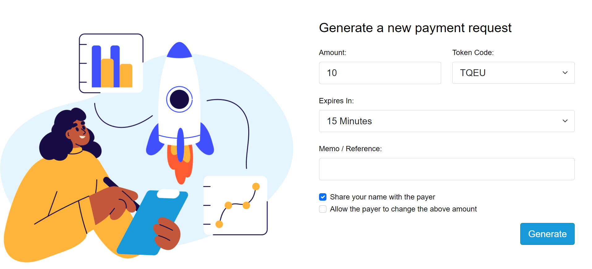
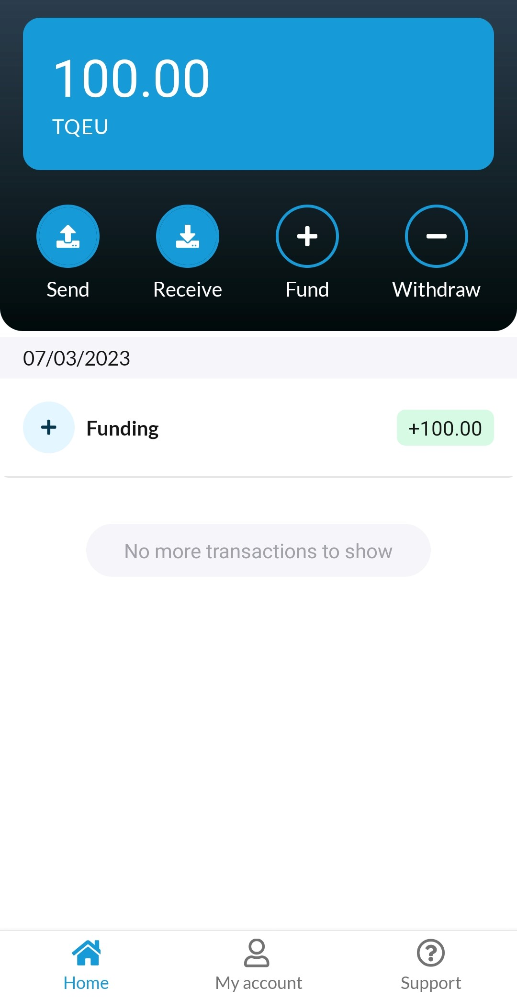
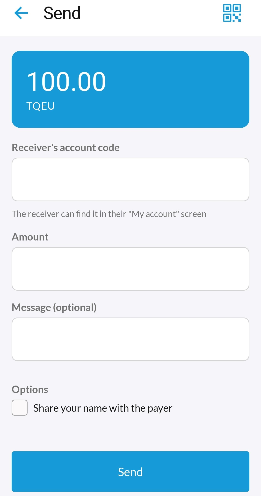
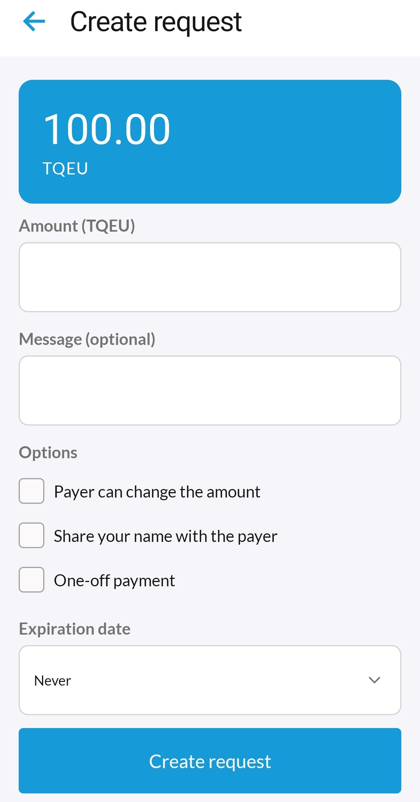

# QBS White Label App
Welcome to the QBS White Label App repository.

The QBS White Label App is a mobile application that allows users to send and receive payments on the blockchain. This app provides a simple and intuitive interface for customers and merchants to manage their account, send and receive payments, and view their transaction history.

This repository contains the source code which can be customized and branded for use by different businesses and organizations.

## Repository Overview

### [AzureB2C](./azureB2C)
This app supports AzureB2C as its identity provider. To help you get setup easier, we provide some templates and policy files that can be uploaded to your domain for authenticating/authorizating your users. 

In this section you will find guides on how to setup and configure an AzureB2C instance.

### [Backend](./backend/README.md)

The backend provides the following functionality:

1. [Core](./backend/core) - An API service that provides core functionality to the frontend applications. This includes functionality such as customer registration, account creation, payment creation and file uploading.

2. [SigningService](./backend/signing-service) - A service for securely storing the private keys of your customers and signing transactions on their behalf.

3. [Web](./backend/web) - A web application that allows customers and merchants to generate and pay payment requests. 

In this section you will find guides on how to build and run the backend APIs.

### [Mobile](./mobile)

The mobile application is available on both IOS and Android. It makes use of the backend API's to execute most of its functionality.

In this section you will find guides on how to build and run the mobile application using Expo.

## Issues and Contributions

We appreciate your interest in contributing to our project. Please read the following guidelines for creating issues and making contributions.

### Issue Creation
- Before creating a new issue, please search the repository to make sure that a similar issue has not already been reported.
- Clearly describe the issue in the title and provide detailed information in the issue description. Include steps to reproduce the issue, expected behavior, and actual behavior.
- If applicable, provide relevant code snippets, screenshots, or other supporting materials to help us understand the issue better.
- Specify the version of the software or the branch of the repository you are using.
- Follow the issue template, if provided, to ensure consistency and completeness of the information.

### Contribution Creation
- Fork the repository and create a branch with a descriptive name related to the contribution you are making.
- Clearly explain the purpose of your contribution in the pull request (PR) description.
- Follow the coding conventions and style guide of the repository.
- Provide clear and concise commit messages.
- Include relevant documentation updates, if applicable.
- Test your contribution thoroughly to ensure it does not introduce new bugs.
- Be responsive to feedback and actively participate in discussions related to your contribution.

### General Guidelines
- Be respectful and professional in your interactions with other contributors.
- Avoid making multiple duplicate issues or PRs for the same contribution.
- If you are unsure about anything, feel free to ask for clarification or guidance from the repository maintainers.
- Note that your contributions will be subject to review and may require revisions before they are accepted.

Thank you for your contributions to our open-source project!

## License

qbs-white-label-app is licensed under an Apache-2.0 license. See the [License](/LICENSE) file for details.
