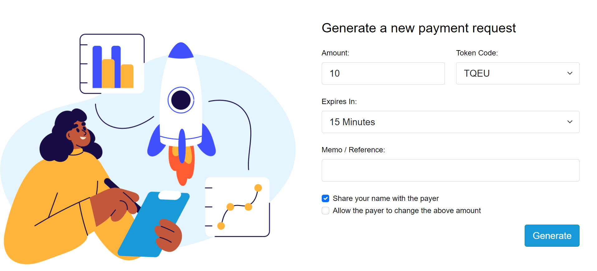
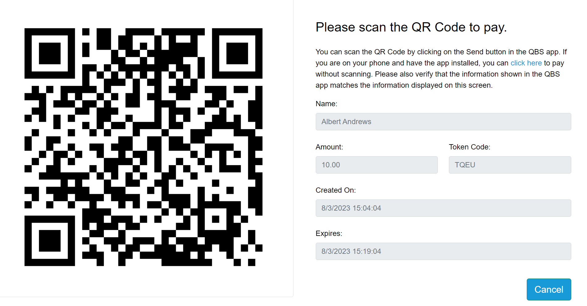
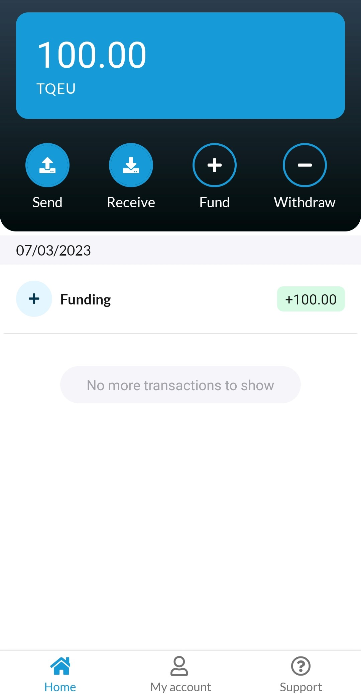
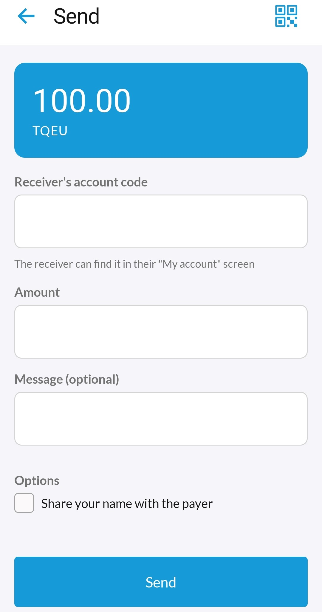
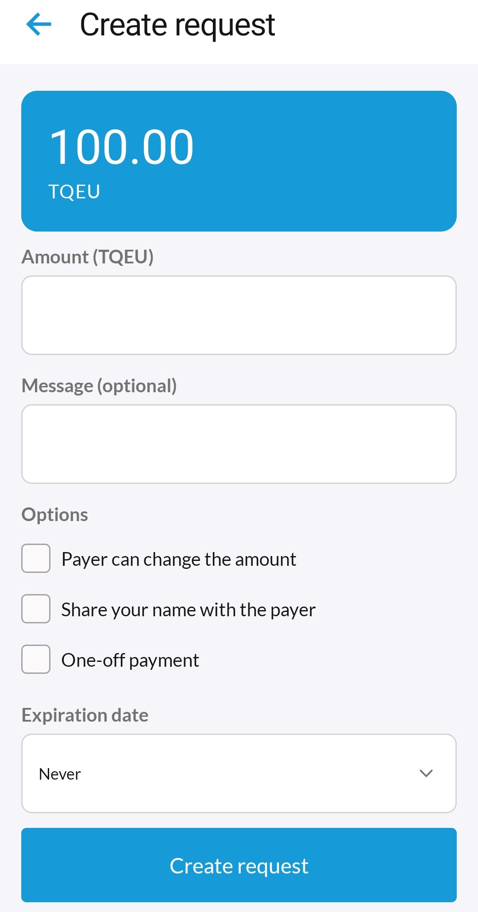

# QBS White Label App
Welcome to the QBS White Label App repository. In here you will find all the information required to setup this app.

## Repository Overview
This repository consists of the following projects:
1. [azureB2C](./azureB2C/README.md)
2. [backend](./backend/README.md)
3. [mobile](./mobile/README.md)

## AzureB2C
This app supports AzureB2C as the default identity provider. To help you get setup easier, we provide some templates and policy files that can be uploaded to your domain for authenticating the user on azure.

## Backend
This contains all the backend functionality of the QBS App. It has 3 projects which are the following:
1. [core](./backend/core) - This API service provides core functionality to the frontend applications. This includes functionality such as customer registration, account creation, payment creation and file uploading.

2. [signing-service](./backend/signing-service) - This service is used for securely storing the private keys of your customers and signing transactions on their behalf.

3. [web](./backend/web) - This web application allows customers and merchants to generate and pay payment requests. 

This shows the initial screen where sales can generate a new payment request. 

This generates a new QR code which can be scanned through the mobile app. 

## Mobile

## License

see [License](/LICENSE.md)