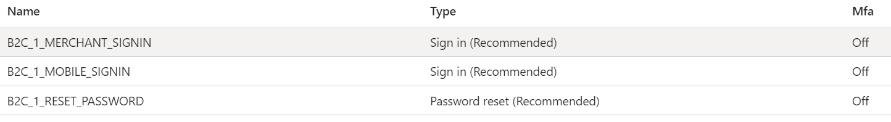
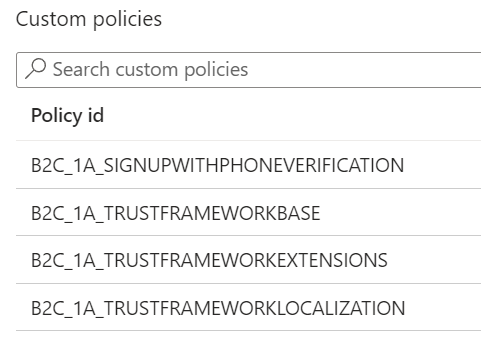
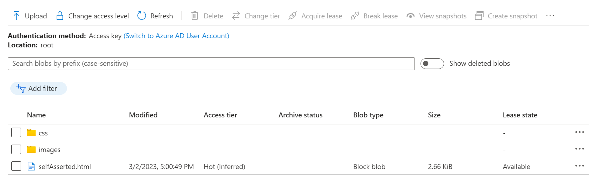
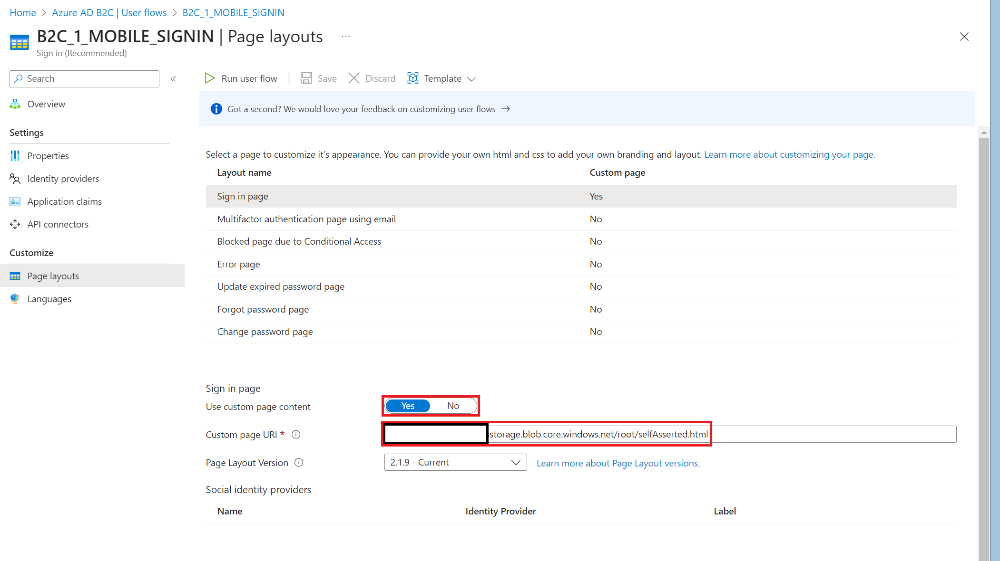

## Setup Azure B2C
This project uses `Azure AD B2C` for user authentication and authorization. To set this up, follow these steps:

## <b>Setup a new `AzureB2C client`</b>

To setup a new AzureB2C client follow these [instructions](https://learn.microsoft.com/en-us/azure/active-directory-b2c/tutorial-create-tenant).

## <b>Register applications`</b>

Once the tenant is created. Select `App Registrations` and register three new applications:

- API
    - Name: `{application name}`-api.
    - Supported account types: Accounts in any identity provider or organizational directory (for authenticating users with user flows).
    - Redirect URI:
        - `Web`: https://jwt.ms (for testing later on)
        - `Web`: https://oauth.pstmn.io/v1/callback (for calling the API from postman)
    
- MOBILE
    - Name: `{application name}`-mobile.
    - Supported account types: Accounts in any identity provider or organizational directory (for authenticating users with user flows).
    - Redirect URI:
        - `Mobile and desktop application`: {expo.config.scheme}://authorize (deep-link to redirect the user back to the mobile after login/registration)

- MERCHANT PORTAL
    - Name: `{application name}`-merchant-portal.
    - Supported account types: Accounts in any identity provider or organizational directory (for authenticating users with user flows).
    - Redirect URI:
        - `Single-page application`: `{core-api-url}`/authentication/login-callback (redirect the user back to the merchant portal after login)

Once the application is registered, note down the `application ID` and the `tenant ID` of all three registered applications.

## Expose API permissions

To ensure applications can only access the resources intended for them AzureB2C supports API permissions. The following permissions are part of the current `Core.API`. Go to the `API` application > `Expose an API` > `Add a scope` and add the following scopes:

| Scopes      | Display Name | Description   |
| :---        |    :----:    |          ---: |
| PaymentRequest.Read      | Read a payment request       | Allows the app to read the payment request details of a user   |
| Customer.Merchant.Create   | Create a merchant customer        | Allows the app to register a customer for a merchant user      |
| Customer.Create      | Create a new customer / merchant       | Allows the app to create a new customer   |
| Withdraw.Create   | Create a withdraw        | Allows the app to create a withdraw for a user      |
| Payment.Create      | Create a payment       | Allows the app to create a payment for a user   |
| PaymentRequest.Create   | Create payment request        | Allows the app to create payment requests for users      |
| PaymentRequest.Merchant.Read      | Read a merchant payment request       | Allows the app to read payment request details of a merchant user |
| PaymentRequest.Merchant.Create   | Create a merchant payment request        | Allows the app to create a payment request for a merchant user     |
| Customer.File.Create      | Create a file for a customer       | Allows the app to create a file for the customer   |
| Customer.Read   | Read existing customer        | Read properties of an existing customer      |
| Transaction.Create      | Create a new transaction       | Allows the app to create a new transaction   |
| Account.Read   | Read existing account        | Allows the app to read an existing account      |
| Account.Create     | Create a new account       | Allows the app to create a new account   |
| Transaction.Read   | Read existing transactions        | Allows the app to read existing transactions      |

## Allow access to API scopes

Once the scopes are created, the next step is to assign the scopes to the applications. To do this select an application e.g. `MOBILE` > `API permissions` > `My APIs` and select the following permissions based on the selected application. Once a permission is connected you need to `Grant admin consent for {name of organization}`.

- MOBILE
    - All permissions than do not contain `Merchant` in their scope name.
    
- MERCHANT PORTAL
    - All permission that do contain `Merchant` in their name
    - `Account.Read`

## <b>Create user flows in Azure Active Directory B2C</b>

User flows are preconfigured user sign in experiences provided by AzureB2C. These are required for a user to login and to reset their password.

- Select `User flows` and create the following three user flows:

    - B2C_1_MERCHANT_SIGNIN - 
        - Name: MERCHANT_SIGNIN
        - Multifactor authentication: Email
        - Token lifetime:
            - Access & ID token lifetimes (minutes): 60
            - Refresh token lifetime (days): 14
            - Refresh token sliding window lifetime: No expiry
            - Lifetime length (days): 90
        - Identity Providers: Email Signin
        - Claim representing user flow: `tfp`
        - Application Claims: User's Object ID
    - B2C_1_MOBILE_SIGNIN - 
        - Name: MOBILE_SIGNIN
        - Multifactor authentication: Email
        - Token lifetime:
            - Access & ID token lifetimes (minutes): 60
            - Refresh token lifetime (days): 14
            - Refresh token sliding window lifetime: No expiry
            - Lifetime length (days): 90
        - Identity Providers: Email Signin
        - Claim representing user flow: `tfp`
        - Application Claims: User's Object ID
    - B2C_1_RESET_PASSWORD - 
        - Name: RESET_PASSWORD
        - Multifactor authentication: Email
        - Identity Providers: Reset password using email address
        - Claim representing user flow: `tfp`
        - Application Claims: User's Object ID

## <b>Setup Custom policies</b>

Most functionality can be achieved using the default flows provided by AzureB2C. However, for the sign up flow we would like to return the phone number used during 2FA authentication. This can only be done using custom policies.

- To use custom policies please setup the required applications as described [here](https://learn.microsoft.com/en-us/azure/active-directory-b2c/tutorial-create-user-flows?pivots=b2c-custom-policy#register-identity-experience-framework-applications)

- Once the Identity Experience Framework (IEF) applications have been created. You can configure the custom policy files using the tools provided under: `./custom-policies`.

    - Configure the following properties in the `ieftool.yaml` based on the applications your created.

        - `tenantId` - `http://contoso.onmicrosoft.com`
        - `piefId` - Proxy Identity Experience Framework object ID
        - `iefId` - Identity Experience Framework object ID
    
    - Once the YAML file has been configured run `deploy.ps1`. You should see an `output` folder be created in the same directory.

    - Upload these custom policies in the Azure AD B2C 
        - Select `Identity Experience Framework` > `Upload custom policy`
        - In this order, upload the policy files from the `output` folder:
            - TrustFrameworkBase.xml
            - TrustFrameworkLocalization.xml
            - TrustFrameworkExtensions.xml
            - SignUpWithPhoneVerification.xml

## <b>Testing</b>

- To test the user flows you can follow these [instructions](https://learn.microsoft.com/en-us/azure/active-directory-b2c/tutorial-create-user-flows?pivots=b2c-custom-policy#test-the-custom-policy)

## <b>Customizing login experience using HTML templates</b>

AzureB2C supports default templates for the registration and sign in screens. However,
if you wish to customize the look and feel of these screens you can provide custom templates. 

To use custom templates first setup a container as described [here.](https://learn.microsoft.com/en-us/azure/active-directory-b2c/customize-ui-with-html?pivots=b2c-user-flow#2-create-an-azure-blob-storage-account)

1: Once the container has been setup you can upload the contents of the folder: `./custom-layouts` to the `root` folder of your container.

2: Once the documents have been uploaded to the container. You need to connect the new layouts to the user flows. To do this select a user flow e.g. `B2C_1_MERCHANT_SIGNIN` and execute the following:

- Select `Page layouts` and configure the `Custom page URI` to the path of the `selfAsserted.html` file located in the container.
- Select `Properties` and set the `Enable JavaScript enforcing page layout` property to `Yes`.

Repeat this process for all user flows.

## Configuring the `Core.API` and `Mobile`

To configure the `mobile` application please follow the guide [here](../mobile/).

To configure the `core` application please follow the guide [here](../backend/core/)

