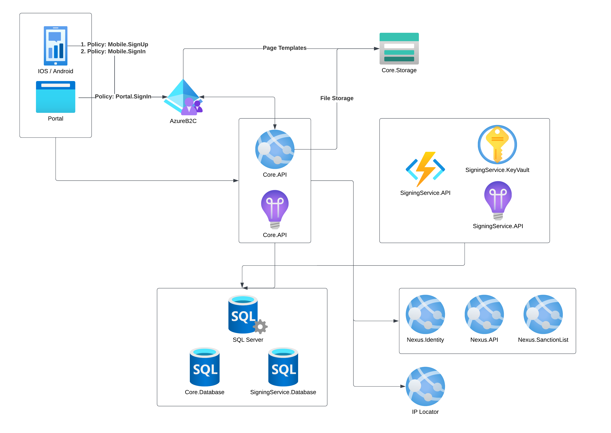
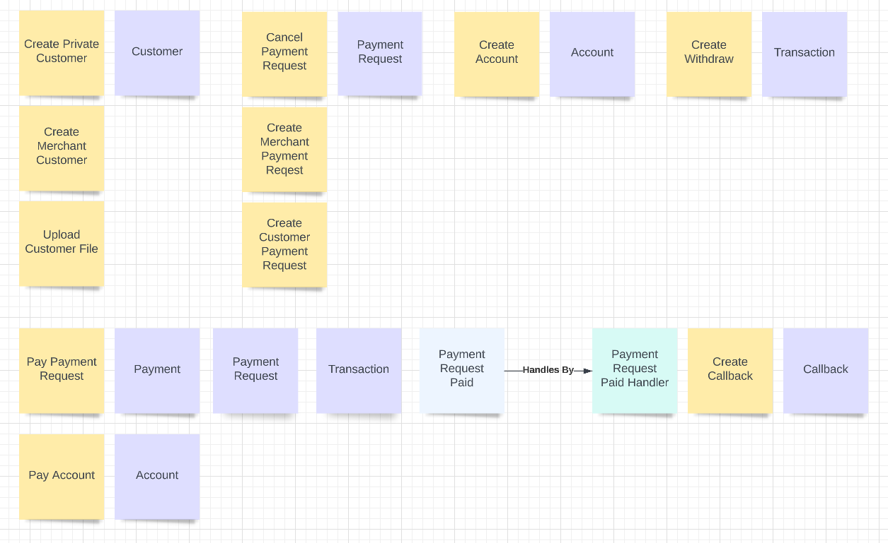

## Overview

### Azure Infrastructure

The following diagram shows an overview of the complete project hosted on Azure.



### Domain Driven Design

This project follows a Domain Driven Design with CQRS approach. You can find some more information [here](https://learn.microsoft.com/en-us/dotnet/architecture/microservices/microservice-ddd-cqrs-patterns/ddd-oriented-microservice). The following diagram shows an overview of the commands (yellow), entities (purple) and events (light blue).



## Installation

To run or host the APIs the following is required:

1. <b>AzureB2C</b> instance (You can find the details to set this up [here](../../azureB2C/README.md))
2. <b>Nexus</b> instance (Please get in [contact](https://quantoz.com/contact/) with us to setup a Nexus subscription for you).
3. <b>Signing Service</b> instance (You can find details to set this up [here](../signing-service/README.md))
4. <b>Azure Blob Storage</b> instance (You can find details to set this up [here](https://learn.microsoft.com/en-us/azure/storage/blobs/blob-containers-portal))
5. <b>MS SQL Server</b> instance (This can be [locally](https://learn.microsoft.com/en-us/sql/database-engine/configure-windows/sql-server-express-localdb?view=sql-server-ver16) or [hosted](https://learn.microsoft.com/en-us/azure/azure-sql/database/single-database-create-quickstart?view=azuresql&tabs=azure-portal))
6. <b>IPLocator</b> instance (You can find details [here](https://ip-api.com/docs/api:json). There is also a free tier available)

### Example Appsettings.json
```json
{
  "AzureB2COptions": [
    {
      "Issuer": "https://contoso.b2clogin.com/tfp/{TenantID}/b2c_1_mobile_signin/v2.0/",
      "Audience": "" // application ID of the xxx-api application registered under AzureB2C
    },
    {
      "Issuer": "https://contoso.b2clogin.com/tfp/{TenantID}/b2c_1_merchant_signin/v2.0/",
      "Audience": "" // application ID of the xxx-api application registered under AzureB2C
    },
    {
      "Issuer": "https://contoso.b2clogin.com/tfp/{TenantID}/signup_withphoneverification/v2.0/",
      "Audience": "" // application ID of the xxx-api application registered under AzureB2C
    }
  ],
  "NexusOptions": {
    "ApiUrl": "https://testapi.quantoz.com",
    "PaymentMethodOptions": {
      "Payout": "LP_INSTANT_PAYOUT_XLM_EUR" // see https://testdocs.quantoznexus.com/articles/configure-nexus/initial_setup.html#payment-methods for information on payment methods.
    },
    "AuthProviderOptions": { // see https://testdocs.quantoznexus.com/articles/start-developing/sd_authentication.html to setup Nexus authentication.
      "IdentityUrl": "https://testidentity.quantoz.com",
      "ClientId": "FcSHavRaIyksRRYTsIFXNYYYINyaEwyR",
      "ClientSecret": "secret",
      "Scopes": "api1 sanctionlist"
    }
  },
  "TokenOptions": {
    "Blockchain": "STELLAR",
    "CustomerTokens": [ "SCEUR" ]
  },
  "ComplianceOptions": {
    "BlacklistedCountries": "", // comma seperated list of countries
    "MerchantTrustlevels": { // see https://testdocs.quantoznexus.com/articles/knowledge-base/kb_trust_levels.html?q=trustlevels for information on trust levels
      "Tier1": "BTier1",
      "Tier2": "BTier2",
      "Tier3": "BTier3"
    },
    "PrivateTrustlevels": {
      "Tier1": "Tier1",
      "Tier2": "Tier2",
      "Tier3": "Tier3"
    }
  },
  "SanctionlistOptions": {
    "BaseUrl": "https://testsanctionlist.quantoz.com",
    "Sanctionlists": "OFAC,EU,NL",
    "MaximumSanctionlistScore": 8
  },
  "IPLocatorOptions": {
    "BaseUrl": "https://pro.ip-api.com",
    "Key": "" // only required for paid tiers
  },
  "SigningServiceOptions": {
    "BaseUrl": "https://signing-service.azurewebsites.net",
    "CreateSigningPairKey": "create_signing_pair_function_key",
    "CreateSignatureKey": "create_signature_function_key",
    "StellarNetworkPassPhrase": "Public Global Stellar Network ; September 2015"
  },
  "BlobStorageOptions": {
    "StorageConnectionString": "DefaultEndpointsProtocol=https;AccountName=yourstorename;AccountKey=yourstorekey;EndpointSuffix=core.windows.net",
    "ContainerName": "your-container-name"
  },
  "ConnectionStrings": {
    "Database": "Data Source=(localdb)\\MSSQLLocalDB;Initial Catalog=quantoz-payments-db;Integrated Security=True;Connect Timeout=30;Encrypt=False;TrustServerCertificate=False;"
  },
  "CORSOptions": { // only required if the API is access by a browser running on a different server. 
    "AllowedOrigins": [],
    "AllowedMethods": []
  },
  "Quartz": {
    "ProcessCallbacksJob": "0/5 * * * * ?"
  },
  // NOTE: all ConfigOptions can be be publically accessed by the user. DO NOT configure any secrets here.
  "ConfigOptions": { // configuration for the Portal running
    "Portal": {
      "AzureAd": {
        "ClientId": "deef8c58-fa77-4703-ad55-982bbebbe85f",
        "Authority": "https://contoso.b2clogin.com/contoso.onmicrosoft.com/B2C_1_merchant_signin",
        "ValidateAuthority": true,
        "DefaultScopes": [ 
            "https://contoso.onmicrosoft.com/70756d5e-ffd2-47a7-ba93-ffa374094c5e/PaymentRequest.Merchant.Create",
            "https://contoso.onmicrosoft.com/70756d5e-ffd2-47a7-ba93-ffa374094c5e/PaymentRequest.Merchant.Read",
            "https://contoso.onmicrosoft.com/70756d5e-ffd2-47a7-ba93-ffa374094c5e/Account.Read"
        ]
      },
      "Deeplinks": {
        "PaymentRequests": "exp://10.8.42.132:19000/--/paymentrequests/{0}"
      }
    }
  },
  "AllowedHosts": "*"
}
```

## Postman
We have included a JSON file [here](../../docs/Postman/QP_API.postman_collection.json) that contains Postman scripts which can be used to test the API endpoints.

To use these scripts, follow these steps:
1. Download and install postman if you haven't already. You can download it from [here](https://www.postman.com/downloads/).
2. Open Postman and import the collection file that contains the scripts.
3. Once the collection is imported, you can select it from the `Collections` tab in the left-hand sidebar. This will show you a list of all the requests included in the collection.
4. Setup the `Environment` to switch between different configurations. We have included an environment [here](../../docs/Postman/Development.postman_environment.json) as a sample -
  - Enter a name for your environment (e.g. "Development", "Testing", "Production").
  - Add the variables you want to use in your requests or scripts by clicking on the 'Add' button next to the 'Initial Value' field.
  - Repeat the above steps to create additional environments as needed.
  To use an environment in a request or script, click on the `Environment` dropdown menu in the top-right corner of the Postman window, and select the environment you want to use.
  Use the variables in your requests or scripts by enclosing them in double curly braces (e.g. {{variable_name}}).
5. To authorize yourself with the backend API and ensure that you have the necessary permissions to access and manipulate the data, click on the `Authorization` tab in the collection.
  - Type: oAuth 2.0
  - Add auth data to: Request Headers
  - Configuration Options:
    - Grant Type: Authorization Code
    - Callback URL: https://oauth.pstmn.io/v1/callback
    - Auth URL: {{auth_url}}/authorize
      - where {{auth_url}} = {tenantName}/{domain}/{signinPolicyName}/oauth2/v2.0
    - Access Token URL: {{auth_url}}/token
    - Client ID: {{auth_client_id}}
      - where {{auth_client_id}} = application ID of the xxx-mobile application registered under AzureB2C
    - Client Secret: {{auth_client_secret}}
      - where {{auth_client_secret}} = client secret of the xxx-mobile application registered under AzureB2C
    - Scope: {{domain}}/{{auth_app_id}}/{{required_Permission}}
      - where {{auth_app_id}} = application ID of the xxx-api application registered under AzureB2C <br />
              &emsp; &emsp; &ensp;{{required_Permission}} = permission configured under AzureB2C
    - Click on 'Get New Access Token' to get a new access token for the requests.
6. To use a script, simply click on the request in the collection that you want to run. This will open the request details in the main window, where you can edit the request parameters and headers if necessary.
7. To run the script, click on the `Send` button in the top-right corner of the request details window. This will send the request to the API endpoint and display the response in the main window.